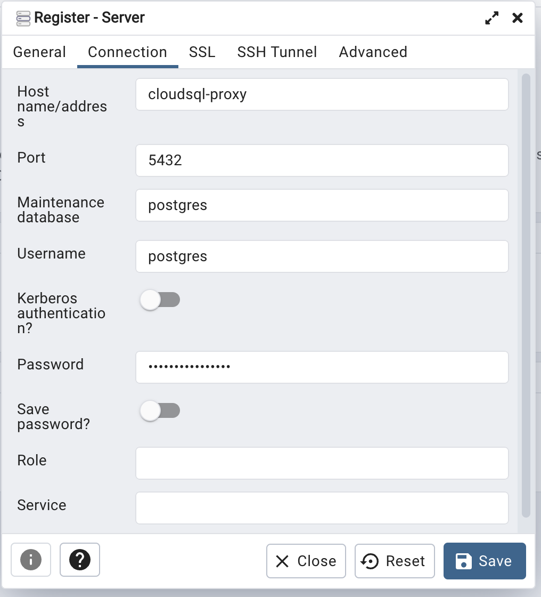
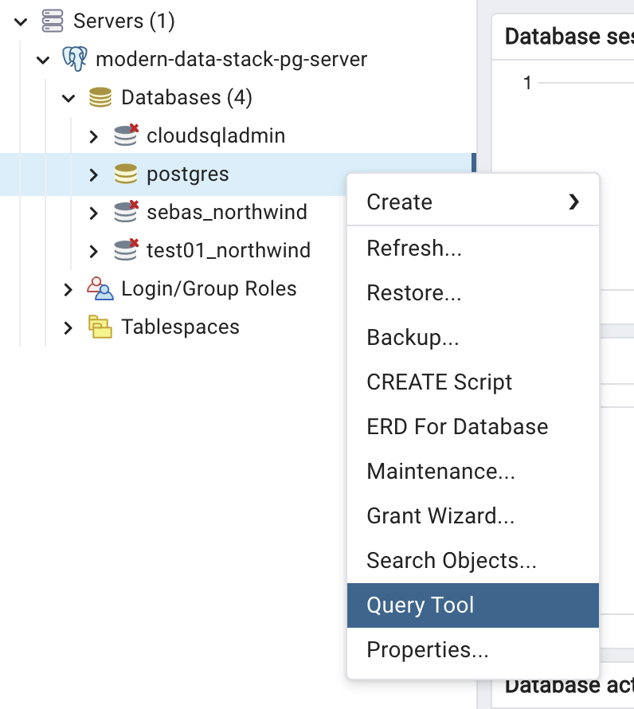
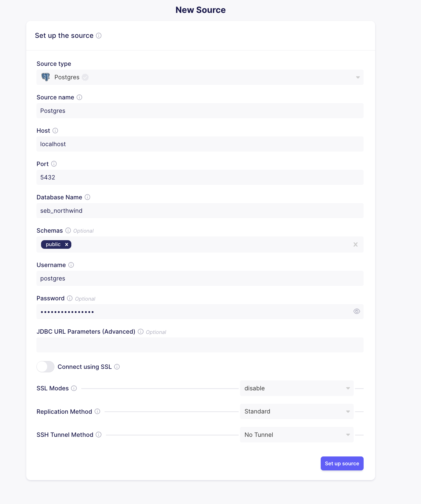
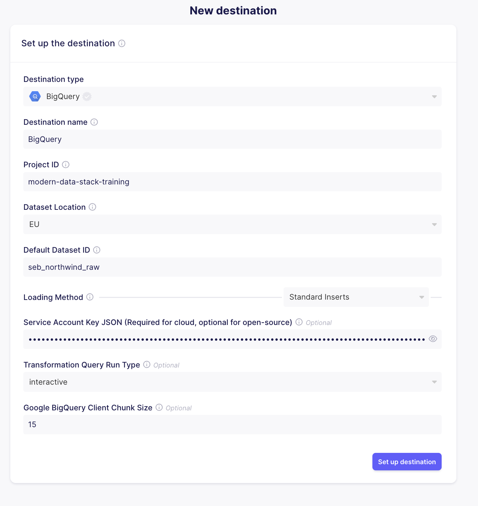
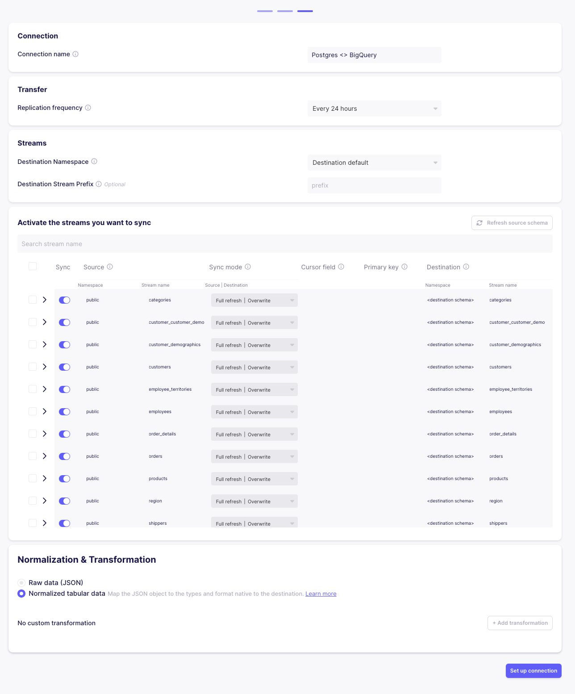
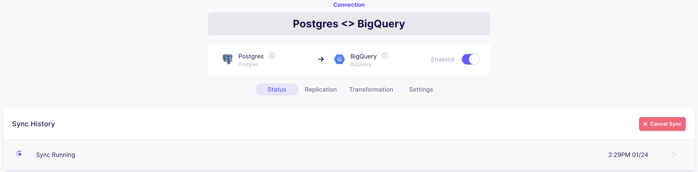
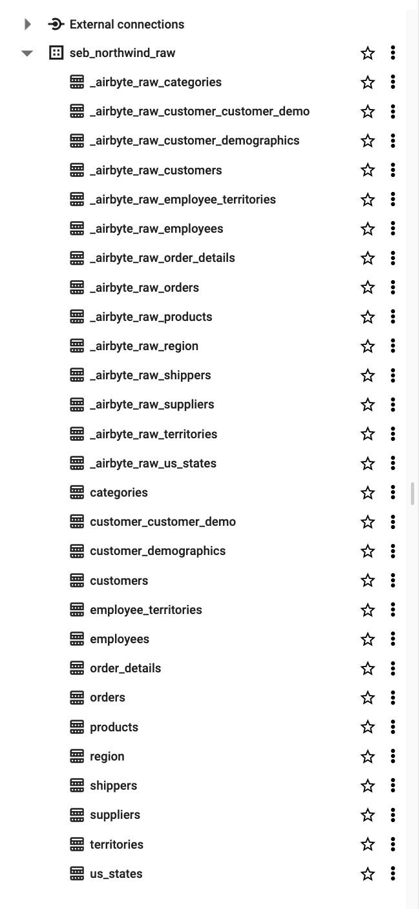
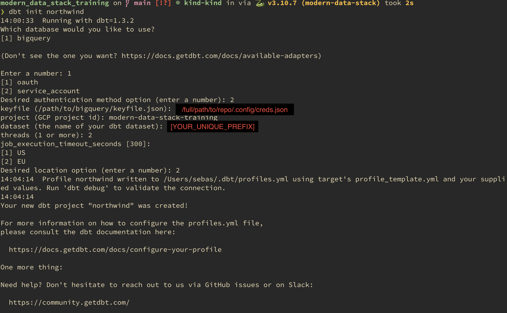

# Modern Data Stack Training

Setup instructions and exercises for the Modern Data Stack training session.

> NOTE: Cloud SQL will be powered down after each training session to prevent excessive/unnecessary cost accumulation.

## 🚨 Why `<YOUR_UNIQUE_PREFIX>`?

Unfortunately because of cost and technical limitations certain services need to be shared
among all participants, e.g. database instances.
Therefore it is necessary to prefix these with a unique string to prevent conflicts
or accidental overwrites of other people's work.

So in the remainder of this training wherever `<YOUR_UNIQUE_PREFIX>` is
mentioned you should replace that with your actual unique prefix string, e.g.
using your name (i.e. `<YOUR_UNIQUE_PREFIX>_database` becomes 
`john_database`)

## Getting Started

**Prerequisites:**
* Docker is installed and running
* You have the GCP credentials `.json` key file - See Slack
* You have the CloudSQL's postgres db password - See Slack

> ⚠️ The below shell commands are assuming a unix-like OS, e.g. macOS or Linux.

1. In the root of the repository create a directory `.config` (this directory is gitignored)
2. Put the `.json` GCP credentials key file in there as `creds.json`
    * NOTE: the cloud sql proxy defined in the docker compose yaml file will use this
3. Run docker-compose (from the root of the repository):
    * Make sure docker
    ```sh
    docker compose up
    ```
    This will create the following services:
        * CloudSQL Proxy - to connect to the postgres instance on GCP
        * pgAdmin - a webapp to navigate the postgres instance and execute commands on it
        * Airbyte - a (local) server and fronted (webapp) to load data from postgres to BigQuery (in our case)
4. 🙏 Hopefully docker compose instantiated all services successfully 🙏

## Create the source database - pgAdmin

We are going to use pgAdmin to connect to the CloudSQL instance on GCP, create a database and populate it.

1. Navigate to `http://localhost:8080`
2. Login with
    * username: `admin@admin.com`
    * password: `root`
3. Click on `Add New Server`
4. Give the server a name, e.g. `modern-data-stack-pg-server`
5. In the `Connection` tab configure the following:
    * Host name/address: `cloudsql-proxy`
    * Port: `5432`
    * MaintenanceDB: `postgres`
    * Username: `postgres`
    * Password: `<see slack for password>`

<details>
<summary>Toggle to show image</summary>

</details>

6. Click `Save`
7. We should now be connected to the CloudSQL postgres instance on GCP
    * The sidebar should now contain this server
    * Expand this see its databases
8. Right click on the `postgres` database and click `Query Tool`

<details>
<summary>Toggle to show image</summary>

</details>

9. Now let's create our source database:
    > 🚨 Because we are working with only a single postgres instance every one should prefix a unique string, e.g. your name, to make the database name unique
    
    Copy-paste the following SQL into the Query Tool, replace `<YOUR_UNIQUE_PREFIX>` with your unique prefix and run the query (F5 - keyboard shortcut).

    ```sql
    CREATE DATABASE <YOUR_UNIQUE_PREFIX>_northwind
    WITH
    OWNER = postgres
    ENCODING = 'UTF8'
    CONNECTION LIMIT = -1
    IS_TEMPLATE = False;
    ```

10. In the sidebar right click on `Database` and click `Refresh`, your database should be visible there now

> With the source database created we can populate it with tables and data for the dummy retail store Northwind.
>
> ⚠️ To make sure subsequent queries will be run against your new database close the existing Query Tool which is connected to the `postgres` database

11. Open the `Query Tool` on the (newly created) source database, i.e. right click on the `<YOUR_UNIQUE_PREFIX>_northwind` database and click `Query Tool`
12. Copy-paste the SQL from `data_source/create_northwind.sql` into the Query Tool and run it
13. If the script ran successfully, in the sidebar, under your Databases -> `<YOUR_UNIQUE_PREFIX>_northwind` -> Schemas -> public -> Tables
    * If the tables do not show up a refresh of the database might be required
14. To double check the query worked, clear the opened Query tool and run:
    ```sql
    select * from customers;
    ```
    This should return all 91 customers.
    
## Load source data into BigQuery - Airbyte

> NOTE: after restart of airbyte, i.e. `docker compose down` -> `docker compose up`,
> if the docker volumes where **not** deleted then the anything configured, e.g.
> sources, destinations and connections, will still exist. So the setup for these
> components should only have to be done once.
 
1. Go to `http://localhost:8000`
2. Login with the following credentials
    * Username: `airbyte`
    * Password: `password`
3. To create a data source, click `Sources` in the sidebar and select source type `Postgres`
4. Set up Source:
    * Host: `localhost`
    * Port: `5432`
    * Database Name: `<YOUR_UNIQUE_PREFIX>_northwind`
    * Username: `postgres`
    * Password: `<see slack for password>`

<details>
<summary>Toggle to show image</summary>

</details>

5. Click `Set up source`
    * This will create the source and test the connection
    * Should anything be wrong with the connection details Airbyte should pick this up.
6. To create a data destination, click on `Destinations` and select destination type `BigQuery`
7. Set up Destination:
    * Project ID: `modern-data-stack-training`
    * Dataset Location: `EU`
    * Default Dataset ID: `<YOUR_UNIQUE_PREFIX>_northwind_raw`
        * 🚨 A prefix is again required to avoid conflicts because we are working in the same BigQuery instance
        * Note also that the dataset does not have to exist yet, Airbyte will create a dataset in BigQuery by this name
    * Service Account Key JSON: copy-paste the contents of the `.json` credentials file into the field
        * The file should exist at `.config/creds.json`, as we've set it up in the beginning

<details>
<summary>Toggle to show image</summary>

</details>

8. Click `Set up destination` 
    * Just like with the source Airbyte will verify the connection details.
9. Create a `Connection`: go to `Connections` (in the sidebar) and click `Create your first connection`
10. Select an existing source: `Postgres`
11. Click `Use existing source`
12. Select an existing destination: `BigQuery`
13. Click `Use existing destination`
14. A new connection setup should be shown. All fields can be left unchanged. At the bottom click `Set up Connection`
    * This create the connection and automatically start the initial sync process
    * Under `Connections`->`Postgres<>BigQuery`->`Status`->`Sync History` the sync should be running.
    * After the sync is done navigate to BigQuery `https://console.cloud.google.com/bigquery?project=modern-data-stack-training`
        * Under the `<YOUR_UNIQUE_PREFIX>_northwind_raw` some `_airbyte_*` tables should be created alongside the source tables, e.g. `customers`, `orders`, etc.
        * For each table Airbyte has added some metadata columns: `_airbyte_ab_id`, `_airbyte_emitted_at`, `_airbyte_normalized_at`, `_airbyte_products_hashid`.
        * The types for each table should be the same as in the source (postgres). However the nullability has not been carried over.

<details>
<summary>Toggle to show image (Connection Setup)</summary>

</details>

<details>
<summary>Toggle to show image (Connection Sync)</summary>

</details>

<details>
<summary>Toggle to show image (BigQuery Raw Data)</summary>

</details>

## Transform raw data - dbt

Now that the we have loaded the raw data into our analytics database, BigQuery,
we can use dbt to define transformations (e.g. `join`s and aggregations) that
will help us reach our analytics goals, be that business intelligence or ML.

* [Install dbt](https://docs.getdbt.com/docs/get-started/pip-install)
    * `pip install dbt-bigquery` should suffice
        * Perhaps using a Python virtual environment if preferred.


### [Create a project](https://docs.getdbt.com/tutorial/create-a-project-dbt-cli#create-a-project)

The dbt CLI comes with a command to help you scaffold a dbt project.
To create your dbt project:

1. Ensure dbt is installed by running `dbt --version`:
    ```sh
    dbt --version
    ```

2. Initialize your dbt project, run:
    ```sh
    dbt init northwind
    ```
    Follow the instructions. You will be asked about:
        * Which database adapter to use: `BigQuery`
        * Authentication method: `service_account`
        * Authentication keyfile path: `/full/path/to/repo/.config/creds.json`
        * GCP Project ID: `modern-data-stack-training`
        * Your dataset name: `<YOUR_UNIQUE_PREFIX>_dbt`
            * NOTE: we haven't created this (BigQuery) dataset yet, which is okay, dbt will create it for us and place all output tables there.
        * Region: `EU`

<details>
<summary>Toggle to show image (BigQuery Raw Data)</summary>

</details>

3. `cd` into your project:
    ```sh
    cd northwind
    ```

You can use `pwd` to confirm that you are in the right spot.

4. Open your project (i.e. the directory you just created) in a code editor like Atom or VSCode.
   You should see a directory structure with `.sql` and `.yml` files that were generated by the `init` command.


Test dbt's connection to BigQuery:

5. Run `dbt debug` to test the connection was setup correctly
    * If the connection test failed have a look at the `profiles.yaml` configuration
        * This is a file that dbt created during the init process and is saved at `~/.dbt/profiles.yaml` by default
        * It contains the connection information
    * `profiles.yaml` should look like this
    ```yaml
    northwind:
      outputs:
        dev:
          dataset: <YOUR_UNIQUE_PREFIX>_dbt
          job_execution_timeout_seconds: 300
          job_retries: 1
          keyfile: /full/path/to/repo/.config/creds.json
          location: EU
          method: service-account
          priority: interactive
          project: modern-data-stack-training
          threads: 2
          type: bigquery
      target: dev
    ```

### [Perform your first dbt run](https://docs.getdbt.com/tutorial/create-a-project-dbt-cli#perform-your-first-dbt-run)

Our freshly created project has some example models in it.
We're going to check that we can run them to confirm everything is in order.

Execute the `dbt compile` command to build the example models.

#### Exercises

* Look at what the compiled sql code looks like in `target/compiled/northwind/models/example`
    * How does the model differ from the compiled `.sql` file?
* Compare the two examples, do you see any differences in the [DDL language](https://www.sqlshack.com/sql-ddl-getting-started-with-sql-ddl-commands-in-sql-server/)?
    * How do the model configurations differ?
    * Which Jinja function are used?


### Structure your dbt project

> NOTE: the `models/example` directory can be deleted from this point onwards

For now the most important parts of the generated dbt project structure are:
* `models/` directory
    * Here we create `.yml` files to define source tables and data models we wish to test and document.
    * And the actual `.sql` (Jinja-templated) models that define our transformation.
* `dbt_project.yml` 
    * The `models.northwind` property is used to define defaults for our models,
    e.g. the materialization
    
In theory dbt will work just fine if we create a single `.yml` file in `models/` and 
configure all our sources and models in there.
However splitting up the `.yml` files and creating some directories to include
specific models should improve organization of our models a bit.

Under `models/` we will create
* A `staging/` directory
    * This is the entry point to our transformation pipeline(s)
    * Models defined here are prefixed with `stg_`, e.g. `stg_orders.sql`
    * [Best practice](https://docs.getdbt.com/guides/best-practices/how-we-structure/2-staging#staging-models) is to only apply the following transformations in this phase of the pipeline:
        * Renaming
        * Type casting
        * Basic computations (e.g. cents to dollars)
        * Categorizing (using conditional logic to group values into buckets or booleans, such as in the case when statements above)
        * ❌ Staging models should not include any joins or aggregations.
* A `marts/` directory
    * Transformations in these models generally contain joins or aggregations
    * Mart models are refined from staging models and prepared for use by an external tool (e.g. dashboard or ML training pipeline)

This results in the following structure:
```txt
northwind/models
├── marts
│   ├── _models.yml
│   └── orders.sql
└── staging
    ├── _models.yml
    ├── _sources.yml
    └── stg_orders.sql
```

* `_sources.yml`: here source tables are defined which should be referenced in staging models
    * Source tables should generally only be referenced directly in staging models
* `_models.yml`: here data models, e.g. `stg_orders`, are defined alongside possible tests and documentation

### Exercise: Create staging models

Create staging models for `orders`, `order_details`, `products`, `categories` and `employees`
1. [Define sources](https://docs.getdbt.com/docs/build/sources) in `_sources.yml`
1. Create `stg_[NAME].sql` model files with the relevant select statement
    * Use the `source` Jinja function to refer to a source table
    * Select all but the `_airbyte*` columns
1. Run dbt to create the staging models in BigQuery

```sh
dbt run
```

Navigate to BigQuery and have a look at the staging tables dbt should have created (a refresh might be required).

Supplementary exercises:
* Change the [materialization](https://docs.getdbt.com/docs/build/materializations) of `stg_orders.sql`, what happens?
    * Look at the dbt documentation to learn about the different materializations strategies for dbt models. What is the difference between a table and a view?
* Run only a single model at a time ([docs](https://docs.getdbt.com/reference/node-selection/syntax))
* Write some bad SQL to cause an error — can you debug this error?
    * Note that if an error persists even after it should have been fixed, removing the `target/` directory might help. 


### Exercise: Add tests

Adding [tests](https://docs.getdbt.com/docs/building-a-dbt-project/tests) to a project helps validate that your models are working correctly. So let's add some tests to our project!

Models are configured with tests (and documentated) in the `.yml` file using the following structure:
Test are defined in the `.yml` files under the relevant 
```yaml
version: 2

models:
  - name: stg_orders
    columns:
      - name: order_id
```

Read [test docs](https://docs.getdbt.com/docs/build/tests#example) on how to define tests.
Working with dbt's out of the box four generic tests can often be enough to significantly improve data quality insurances.

Try to come up with relevant tests by studying the staging tables on BigQuery.

Here are some test suggestions:

* Test `order_id` is unique and not null for the `stg_orders` model
* Test `employee_id` is unique and not null for the `stg_employees` model
* Test referential integrity, `order_id` in `stg_orders` matches `order_id` in the `stg_order_details` model.
* Test accepted values for `city` in the `stg_employees` model
    * London, Tacoma, Redmond, Seattle, Kirkland

Run the tests to confirm they all pass:
```sh
dbt test
```

Supplementary exercises:
* Write a test that fails, for example, omit one of the cities in the `accepted_values` list. What does a failing test look like? Can you debug the failure?
* Run the tests for one model only. If you grouped your `stg_` models into a directory, try running the tests for all the models in that directory.

### Exercise: [Document your models](https://docs.getdbt.com/tutorial/test-and-document-your-project#document-your-models)

Adding [documentation](https://docs.getdbt.com/docs/building-a-dbt-project/documentation) to your project allows you to describe your models in rich detail, and share that information with your team. Here, we're going to add some basic documentation to our project.

1. Update your `models/staging/_models.yml` file to include some descriptions.
    * Both on model and column level.
1. Execute `dbt docs generate` to generate the documentation for your project.
    * dbt introspects your project and your warehouse to generate a json file with rich documentation about your project, which can be found at `target/catalog.json`
1. [CLI] Execute `dbt docs serve` to launch the documentation in a local website.
    * if necessary specify a different port by using `--port 9090` 

Supplementary exercise:
* Use a [docs block](https://docs.getdbt.com/docs/building-a-dbt-project/documentation#using-docs-blocks) to add a Markdown description to a model.

### Exercise: Creating mart models 

Let's create models in the marts area.
Here we will combine and/or aggregate staging models to create new models which are ready to be used for analytical purposes.

> NOTE: Use the `ref` Jinja function to refer to staging models.

A solution is provided for each exercise for if you get stuck.

1. Create a model `marts/order_details.sql`.
    * Calculate sales price for each order after discount is applied, i.e. create a column like `discounted_total_price`.

<details>
<summary>Solution</summary>

```sql
with
    order_details as (select * from {{ ref("stg_order_details") }}),

    products as (select * from {{ ref("stg_products") }}),

    order_details_extended as (

        select
            order_details.order_id,
            order_details.product_id,
            order_details.unit_price,
            order_details.quantity,
            order_details.discount,
            products.product_name,
            (
                order_details.unit_price
                * order_details.quantity
                * (1 - order_details.discount)
            ) as discounted_total_price
        from products
        inner join order_details using (product_id)

    )

select *
from order_details_extended
```
</details>


2. Create a model `marts/category_sales.sql`
    * This model should calculate the total sales for each product category
    * Group orders by category and sum the total sales for each group.
    * The sales amount calculation for each product sale should use the `discounted_total_price` created in the previous model.

<details>
<summary>Solution</summary>

```sql
with
    products as (select * from {{ ref("stg_products") }}),

    categories as (select * from {{ ref("stg_categories") }}),

    order_details as (select * from {{ ref("order_details") }}),

    category_sales as (

        select
            products.category_id,
            categories.category_name,
            sum(order_details.discounted_total_price) as total_sales
        from products
        inner join order_details on products.product_id = order_details.product_id
        inner join categories on products.category_id = categories.category_id
        group by products.category_id, categories.category_name

    )

select *
from category_sales
```
</details>


3. Create a model `marts/employee_sales.sql`.
    * Calculate the total sale amount for each employee
        
<details>
<summary>Solution</summary>

```sql
with
    employees as (select * from {{ ref("stg_employees") }}),

    orders as (select * from {{ ref("stg_orders") }}),

    order_details as (select * from {{ ref("order_details") }}),

    order_subtotals as (
        select
            order_id,
            sum(order_details.discounted_total_price) as sale_amount
        from order_details
        group by order_id
    ),

    employee_sales as (

        select
            orders.employee_id,
            min(order_date) as first_order_date,
            max(order_date) as last_order_date,
            sum(order_subtotals.sale_amount) as total_sale_amount
        from orders
        inner join order_subtotals on orders.order_id = order_subtotals.order_id
        group by orders.employee_id

    ),
    
    final as (

        select
            employees.first_name,
            employees.last_name,
            employees.country,
            employee_sales.total_sale_amount,
            employee_sales.first_order_date,
            employee_sales.last_order_date,
            date_diff(employee_sales.last_order_date, employee_sales.first_order_date, day) as days_active
        from employee_sales
        inner join employees on employee_sales.employee_id = employees.employee_id
        order by employee_sales.total_sale_amount desc

    )

select *
from final
```
</details>


4. Create a model `marts/orders_per_month.sql`
    * Calculate the total number of orders per month (per year)

<details>
<summary>Solution</summary>

```sql
with
    orders as (select * from {{ ref("stg_orders") }}),

    orders_with_ym as (
        select
            extract(year from order_date) as order_year,
            extract(month from order_date) as order_month,
            *
        from orders
    ),

    final as (
        select order_year, order_month, count(1) as num_orders
        from orders_with_ym
        group by order_year, order_month
        order by order_year, order_month
    )

select *
from final
```
</details>

> This (data) model could be used to train a forecaster model on.

Supplementary exercise:
* Rerun `dbt docs generate` and `dbt docs serve` and have a look at the lineage graph
    * By using the `ref` Jinja function dbt can create this graph
    * This is especially useful for large dbt projects

## Keep learning

* Best practice [how to structure your project](https://docs.getdbt.com/guides/best-practices/how-we-structure/1-guide-overview) 
* Learn how to refactor long SQL queries: [https://docs.getdbt.com/tutorial/refactoring-legacy-sql](https://docs.getdbt.com/tutorial/refactoring-legacy-sql)
