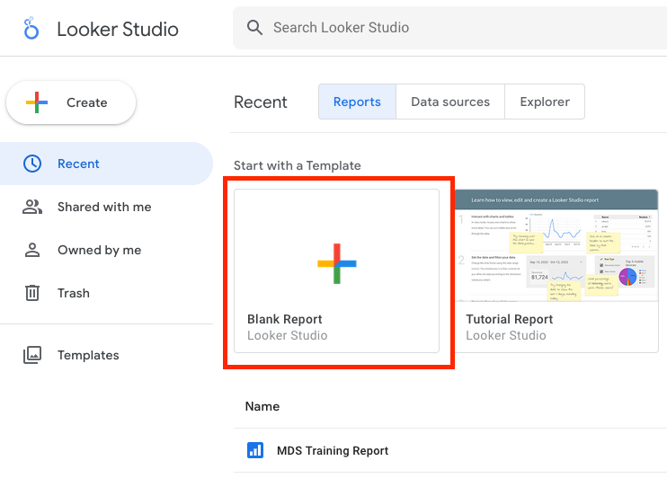
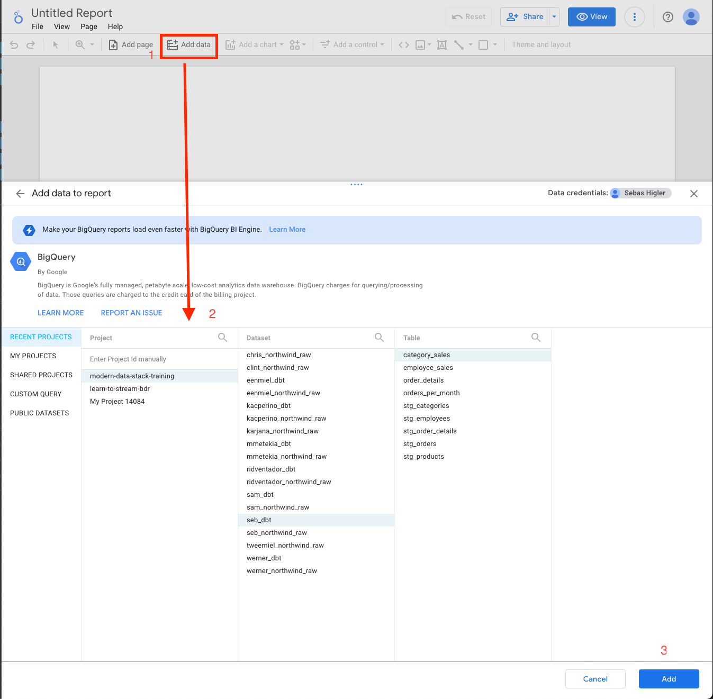
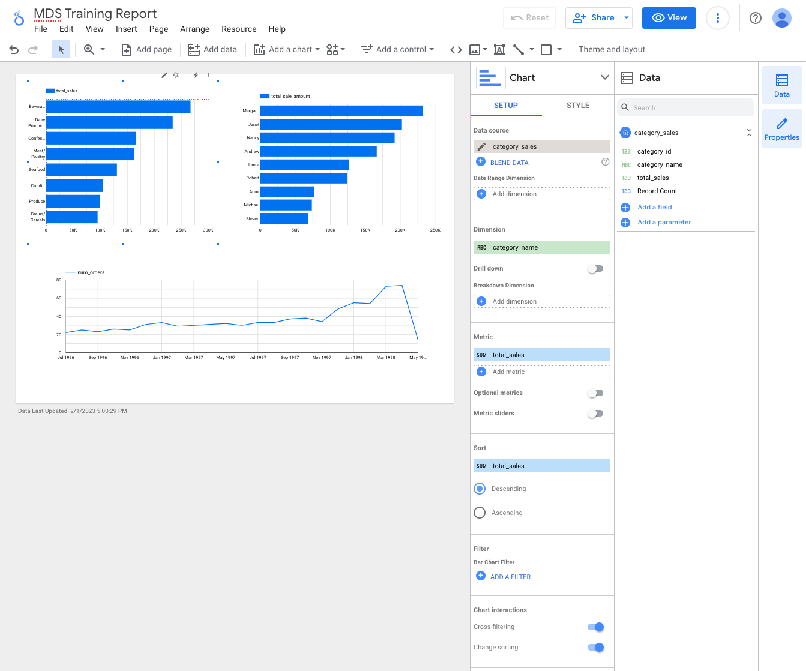
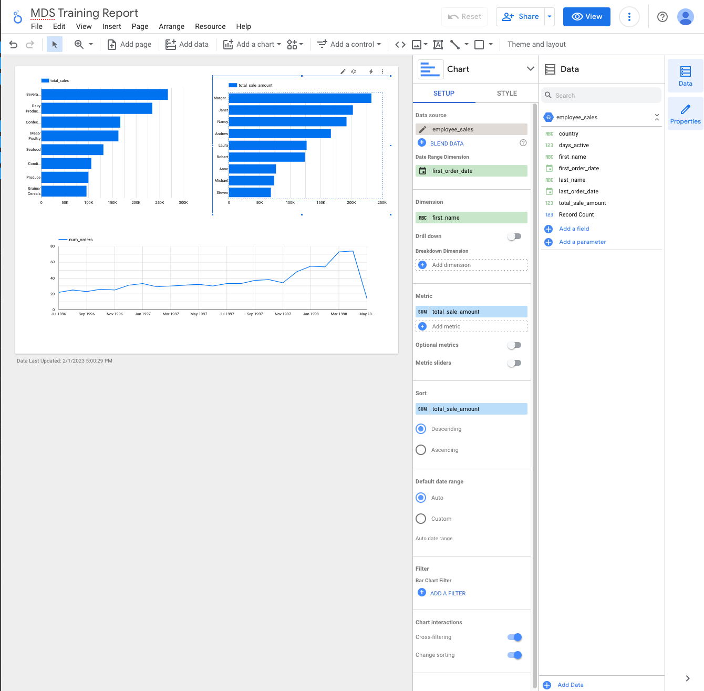
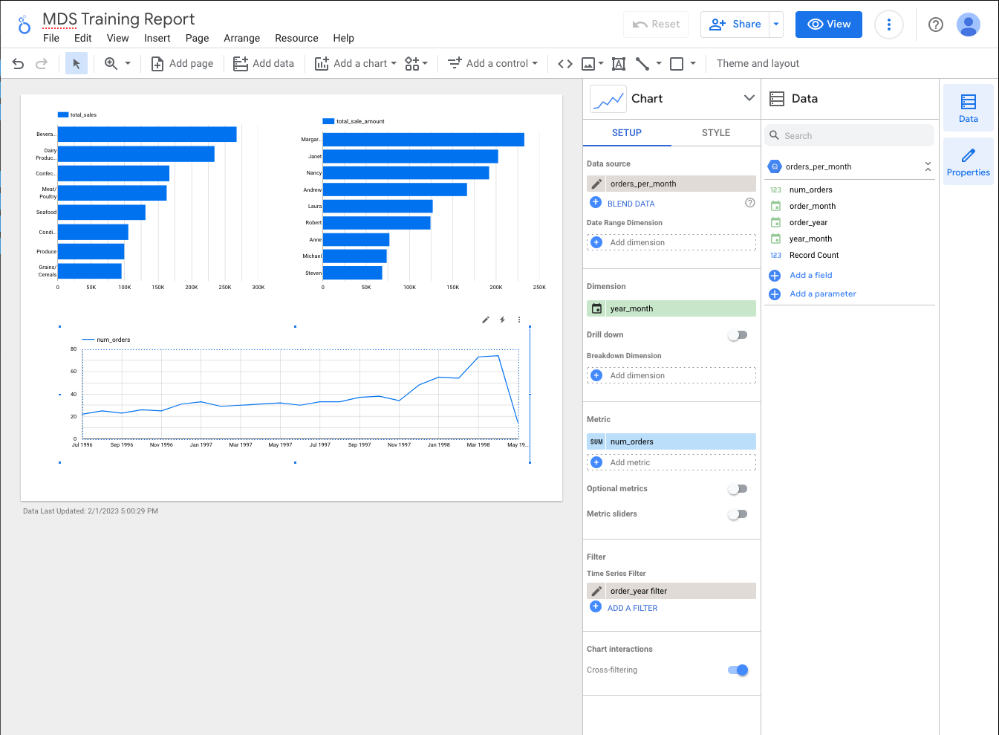

# Modern Data Stack - Session 2

In session 1 we covered:

- Setting up and ingesting a source database (Cloud SQL Postgres)
- Loading source data to a data warehouse (BigQuery) using Airbyte
- Transforming the raw source data in the data warehouse to be used for analytical use cases using dbt
- We've looked at the following dbt concepts:
  - General setup
  - Defining sources and creating data models
  - Running dbt and using different model materializations
  - Writing tests and documentation

In this session we will continue with dbt by covering more advanced topics

- Working with packages
- Writing custom tests
- Writing and using marcos
- Using `incremental` materialization
- Using snapshots

Besides this we will also go through an example of how we can use one of the
analytical data sets we've created in a dashboard.

Not part of this session but in reality there are of course many more ways these tables
can be used and from a data engineers perspective one of the most important
things to figure out is how to handle access and monitoring.

## Packages

Similarly to most programming languages, e.g. Python, dbt also uses the concept of [packages](https://docs.getdbt.com/docs/build/packages) to share third-party code,
generally dbt macros, which is a good way to more easily add useful functionality to your dbt project.
These packages are hosted on the [Packages Hub](https://hub.getdbt.com/).

In the below exercise we will install several packages that will give use more generic tests to use.

### Exercise: Install and use your first packages

We will install the [`dbt_utils`](https://hub.getdbt.com/dbt-labs/dbt_utils/latest/) package.
It is maintained by `dbt-labs` and adds some generally useful macros.

- In the dbt project's root, i.e. the directory with `dbt_project.yml`, create a file `packages.yml`

  - Here we will define all our (package) dependencies

- Add this to `packages.yml`

  ```sql
  packages:
    - package: dbt-labs/dbt_utils
      version: 1.0.0
  ```

- To install this package run `dbt deps` from the dbt project's root

- Try to come up with relevant tests using `dbt_utils` defined macros.
  Here are some test suggestions:

  - Use `not_empty_string` to verify `categories.category_name` is not an empty string.
  - Use `accepted_range` to verify `order_details.discount` has a lower bound of `0` (inclusive) and an upper bound of `1` (inclusive)
  - Use `unique_combination_of_columns` to verify the combination `order_id` and `product_id` uniquely identifies a row in `order_detail`

  > NOTE: These could be added on the sources directly in `staging/_sources.yml` or on the staging models in `staging/_models.yml`

- Run `dbt test` to make sure all tests pass

Supplementary exercise:
Have a look at the [`dbt-expectations`](https://github.com/calogica/dbt-expectations) package and use one of its macros for a test.

## Write advanced test

In session 1 (and the above exercise) we used predefined tests.
Now we will write our own custom tests.

> Note that it is also possible to write custom [singular tests](https://docs.getdbt.com/docs/build/tests#singular-tests).
> These are one-off assertions usable for a single purpose.

### Exercise: Write custom generic test

We will write a [generic reusable test](https://docs.getdbt.com/guides/best-practices/writing-custom-generic-tests#generic-tests-with-default-config-values).
Instead of error-ing this specific test will warn when it fails.

- Create file `tests/generic/warn_if_greater_than.sql`

- Write a test that will _warn_ if a numeric value is greater than the provided value

  <details>
    <summary>Solution</summary>

  ```sql
  

      {{ config(severity = 'warn') }}

      select {{ column_name }}
      from {{ model }}
      where {{ column_name }} > {{ max_value }}

  
  ```

  </details>

> NOTE: dbt tests are select statements which fail if the select statement returns a non-zero amount of rows.

- Try it out:
  - Warn if `orders.freight` is greater than 999

    > NOTE: This test can be added on the source directly in `staging/_sources.yml` or on the staging model in `staging/_models.yml`

    <details>
      <summary>Solution</summary>

    ```yml
    version: 2

    sources:
      - name: <YOUR_UNIQUE_PREFIX>_northwind_raw
        tables:
          - name: orders
            columns:
              - name: freight
                tests:
                  - warn_if_greater_than:
                      max_value: 999
    ```

    </details>

  - Run `dbt test` to verify the warning gets output
  
It is also possible to override the default 'error' severity of predefined tests to 'warn'.
This requires adding additional configuration, see [the docs](https://docs.getdbt.com/reference/resource-configs/severity).

## Macros

We have already used several macros throughout the previous exercises.
Now will write and use our own [custom macros](https://docs.getdbt.com/docs/build/jinja-macros#macros).

### Exercise: Create formatting macro

- Create the file `macros/human_formatted_currency_amount.sql`

- Create file `macros/_macros.yml`

- Write a macro that formats a numeric value as a dollar currency string, i.e. `$300,499.50` or `$9.00`

  <details>
    <summary>Solution</summary>

  ```sql
  
      concat("$", format("%'.2f", cast({{ column_name }} as float64)))
  
  ```

  </details>

- Document the macro in `macros/_macros.yml`

  - Description the macro and it parameters
  - This will also be visible in the generate docs, `dbt docs generate`

  <details>
    <summary>Solution</summary>

  ```yml
  version: 2

  macros:
    - name: to_dollar_currency
      description: A macro to convert a numeric value to dollar currency formatted string
      arguments:
        - name: column_name
          type: string
          description: The name of the column you want to convert
  ```

  </details>

- Use the macro to create a new column in `employee_sales` that contains the dollar formatted total sales

  <details>
    <summary>Solution</summary>

  ```sql
  ...
  employee_sales.total_sale_amount,
  {{ to_dollar_currency('employee_sales.total_sale_amount') }} as total_sale_dollar_fmt,
  ...
  ```

  </details>

- Jinja templates (which include macros) are evaluate at compile time.

  - To see what the macro evaluates to run `dbt compile 'models/marts/employee_sales.sql'`
  - And look at the compiled output (`target/compiled/models/marts/employee_sales.sql`)

## Advanced materialization

Traditional data models run code against the entire dataset each time they are executed, overwriting previous results. Incremental models, on the other hand, run code against the entire dataset only once during the initial run and then only execute on new data in subsequent runs.

Read about pros/cons of different materializations [here](https://docs.getdbt.com/docs/building-a-dbt-project/building-models/materializations#materializations)

### Exercise: Change `stg_orders` materialization to incremental

- [General introduction to incremental models](https://docs.getdbt.com/docs/build/incremental-models)
- [When to use incremental models](https://docs.getdbt.com/docs/build/incremental-models#when-should-i-use-an-incremental-model)

* Simulate adding additional rows by inserting a few samples to the `orders` raw table.

> NOTE: generally these rows would be added to the actual source
> (in our case Postgres), however as an example it is easier to add new rows
> directly to the raw table on BigQuery

- Execute the following insert statements from the BigQuery GCP console:

```sql
NSERT INTO modern-data-stack-training.<YOUR_UNIQUE_PREFIX>_northwind_raw.orders (freight, order_id, ship_via, ship_city, ship_name, order_date, customer_id, employee_id, ship_region, ship_address, ship_country, shipped_date, required_date, ship_postal_code, _airbyte_ab_id, _airbyte_emitted_at, _airbyte_normalized_at, _airbyte_orders_hashid)
VALUES (10.0, 15335, 1, 'Amsterdam', 'Pieter van der Linden', '2022-01-01', 'CONSH', 1, 'Noord', '123 Hoofdstraat', 'NL', '2022-02-01', '2022-03-01', '1000 AB', 'ab_id_1', '2022-01-01 12:00:00', '2022-01-01 12:00:00', 'hash_id_1');

INSERT INTO modern-data-stack-training.<YOUR_UNIQUE_PREFIX>_northwind_raw.orders (freight, order_id, ship_via, ship_city, ship_name, order_date, customer_id, employee_id, ship_region, ship_address, ship_country, shipped_date, required_date, ship_postal_code, _airbyte_ab_id, _airbyte_emitted_at, _airbyte_normalized_at, _airbyte_orders_hashid)
VALUES (20.0, 15472, 2, 'Rotterdam', 'Sophie de Boer', '2022-02-01', 'NORTS', 2, 'West', '456 Keizersgrachtstraat', 'NL', '2022-03-01', '2022-04-01', '3000 AB', 'ab_id_2', '2022-02-01 12:00:00', '2022-02-01 12:00:00', 'hash_id_2');

INSERT INTO orders (freight, order_id, ship_via, ship_city, ship_name, order_date, customer_id, employee_id, ship_region, ship_address, ship_country, shipped_date, required_date, ship_postal_code, _airbyte_ab_id, _airbyte_emitted_at, _airbyte_normalized_at, _airbyte_orders_hashid)
VALUES (15.0, 10462, 3, 'Amsterdam', 'Thomas Jansen', '2022-03-01', 'NORTS', 3, 'Midden', '789 Bloemstraatweg', 'NL', '2022-04-01', '2022-05-01', '1000 AB', 'ab_id_3', '2022-03-01 12:00:00', '2022-03-01 12:00:00', 'hash_id_3');

INSERT INTO orders (freight, order_id, ship_via, ship_city, ship_name, order_date, customer_id, employee_id, ship_region, ship_address, ship_country, shipped_date, required_date, ship_postal_code, _airbyte_ab_id, _airbyte_emitted_at, _airbyte_normalized_at, _airbyte_orders_hashid)
VALUES (12.0, 19472, 1, 'Rotterdam', 'Marieke van den Berg', '2022-04-01', 'DUMON', 4, 'West', '246 Vrijburglaan', 'NL', '2022-05-01', '2022-06-01', '3001 CD', 'ab_id_4', '2022-04-01 12:00:00', '2022-04-01 12:00:00', 'hash_id_4');

INSERT INTO orders (freight, order_id, ship_via, ship_city, ship_name, order_date, customer_id, employee_id, ship_region, ship_address, ship_country, shipped_date, required_date, ship_postal_code, _airbyte_ab_id, _airbyte_emitted_at, _airbyte_normalized_at, _airbyte_orders_hashid)
VALUES (8.0, 14450, 2, 'Den Haag', 'Jan Pieters', '2022-05-01', 'BLONP', 5, 'Zuid', '369 Damstraatje', 'NL', '2022-06-01', '2022-07-01', '2501 AB', 'ab_id_5', '2022-05-01 12:00:00', '2022-05-01 12:00:00', 'hash_id_5');
```

- Change materialization on `stg_orders` model to `incremental`.
- Utilize the `is_incremental()` macro to filter for new rows only.
- \[Optional:\] Configure materialization with a `unique_key='order_id'` to allow for modification of existing rows rather than only adding new ones.
- Run `dbt run -s stg_orders`
  - Only added order rows have been processed
  - Number of rows processed should be visible in logs
- \[Optional:\] run the same model with `--full-refresh` to force rebuilding the table from scratch.

> NOTE: about the complexity incremental models introduce
> see: https://www.getdbt.com/coalesce-2021/trials-and-tribulations-of-incremental-models/

## Snapshots

[DBT snapshots](https://docs.getdbt.com/docs/build/snapshots) record changes made to a mutable model over time, enabling point-in-time queries. This feature uses [Slowly Changing Dimensions type-2](https://www.sqlshack.com/implementing-slowly-changing-dimensions-scds-in-data-warehouses/) and tracks the validity of each row with "from" and "to" date columns.

### Exercise: Capture employees changes

- Create file `snapshots/employees.sql`

- Update the content of `snapshots/employees.sql` file with the snapshot code ``

  - Configure the snapshot
    - `target_schema='<YOUR_UNIQUE_PREFIX>_dbt'`
    - `strategy='check'` (Read more about it [here](https://docs.getdbt.com/docs/build/snapshots#check-strategy))
    - `unique_key='employee_id'`
    - `check_cols=['address', 'postal_code', 'home_phone', 'title_of_courtesy']'`
  - In the body, select from the `employees` source (as done in the staging models)

- Run the command `dbt snapshot` to create the snapshot table

> Examine the created table `employees_snapshot`, you will observe that dbt has incorporated the columns "dbt_valid_from" and "dbt_valid_to," with the latter set to null values. Future executions will modify this

- Update one of the employee existing records in the raw table

```sql
UPDATE `<YOUR_UNIQUE_PREFIX>_northwind_raw.employees`
SET address = '3D Herengrachtstraat', home_phone = '06-12345678' 
WHERE employee_id = 7;

```

- Re-run the `dbt snapshot` to capture the changes
  - Check out `employees_snapshot` for the changes (related to `employee_id = 7`)

## Charts & Dashboards
Having transformed the data, it's now time to convert it into informative and engaging reports. To achieve this, we will utilize Looker Studio, formerly known as Google Data Studio. This platform offers a user-friendly interface for crafting interactive dashboards, charts, and reports, providing a seamless experience for data visualization and analysis.

Read more about Looker Studio features [here](https://cloud.google.com/looker/docs).

### Exercise: Create a Business intelligence (BI) dashboard 

- Go to https://lookerstudio.google.com/

- Create new report

  <details>
    <summary>Toggle to show image</summary>
    
    </details>

- Add the following analytical tables from `modern-data-stack-training.<YOUR_UNIQUE_PREFIX>_dbt` as data sources

  - `category_sales`
  - `employee_sales`
  - `orders_per_month`
  - After all three have been added they should be visible in the right hand side sidebar `"Data"`.

  <details>
    <summary>Toggle to show image</summary>
    
    </details>

- Some chart suggestions:

  - Create a bar chart for `category_sales`
  - Create a bar chart for `employees_sales`
  - Create a time series chart for `orders_per_month`
    - First add a `order_year_month` field to `orders_per_month` as a date type
      - Once added select `Date & Time -> Year Month` from the dropdown of that field's type on the overview
      - Press `Done`
    - On the chart add a `Time Series Filter` on `order_year` to only select orders before the year 2000 (to remove outliers)

  <details>
    <summary>Toggle to show image - Category Sales chart</summary>
    
    </details>

  <details>
    <summary>Toggle to show image - Employee Sales chart</summary>
    
    </details>

  <details>
    <summary>Toggle to show image - Orders Per Month chart</summary>
    
    </details>

## Keep learning

- [What is the modern data stack?](https://hevodata.com/learn/what-is-the-modern-data-stack/)
- [Understanding the Modern Data Stack](https://tanay.substack.com/p/understanding-the-modern-data-stack)
- [What’s So Modern About the Modern Data Stack?](https://neptune.ai/blog/modern-data-stack)
- [Is ETL Still Relevant?](https://www.integrate.io/blog/is-etl-dead/)
- [dbt best practices](https://docs.getdbt.com/guides/best-practices)
- [dbt fundamentals free courses](https://courses.getdbt.com/collections)
- [dbt discourse](https://discourse.getdbt.com/)
- Jinja & Macros for modular and cleaner SQL Queries [Part 1](https://blog.devgenius.io/excelling-at-dbt-jinja-macros-for-modular-and-cleaner-sql-queries-part-1-2-55e29d4b29e2) [Part 2](https://blog.devgenius.io/excelling-at-dbt-jinja-macros-for-modular-and-cleaner-sql-queries-part-2-2-88949c1af46c)